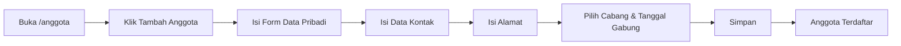
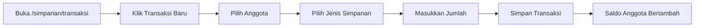
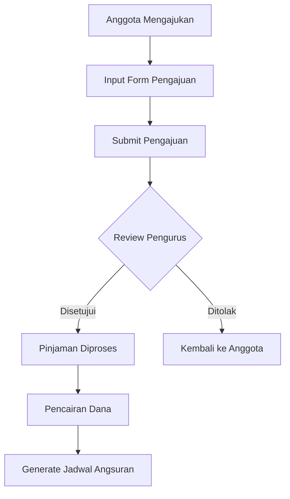
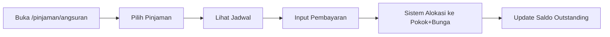
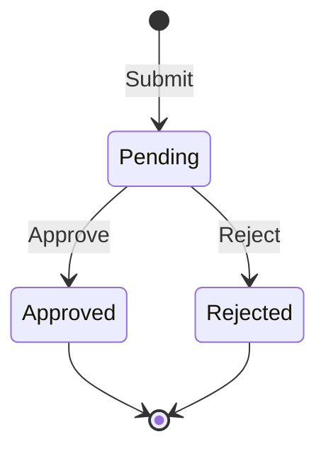
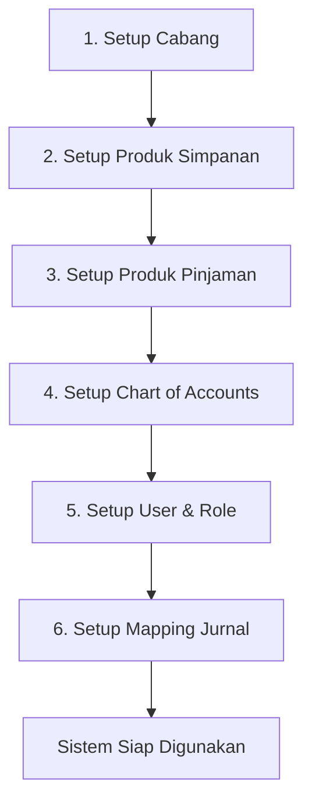
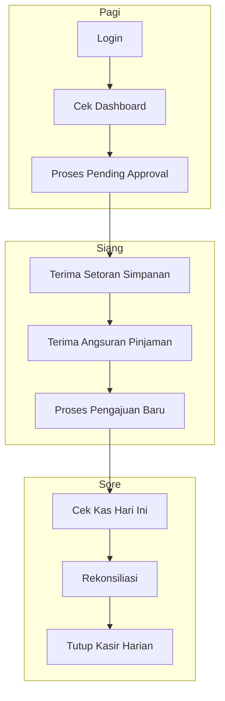

# Panduan Penggunaan Sistem Koperasi Digital

> **Versi:** 1.0  
> **Terakhir Diperbarui:** 30 Januari 2026

---

## 📋 Daftar Isi

1. [Memulai Sistem](#1-memulai-sistem)
2. [Alur Kerja Anggota](#2-alur-kerja-anggota)
3. [Alur Kerja Simpanan](#3-alur-kerja-simpanan)
4. [Alur Kerja Pinjaman](#4-alur-kerja-pinjaman)
5. [Alur Kerja Kas & Bank](#5-alur-kerja-kas--bank)
6. [Alur Kerja Persetujuan](#6-alur-kerja-persetujuan)
7. [Laporan Keuangan](#7-laporan-keuangan)
8. [Pengaturan Master Data](#8-pengaturan-master-data)

---

## 1. Memulai Sistem

### 1.1 Login
```
URL: /login
```
1. Masukkan **Email** dan **Password**
2. Klik tombol **Masuk**
3. Sistem akan mengarahkan ke **Dashboard**

### 1.2 Dashboard Overview
```
URL: /dashboard
```
Setelah login, dashboard menampilkan:

| Widget | Informasi |
|--------|-----------|
| Total Anggota | Jumlah anggota aktif |
| Total Simpanan | Total saldo simpanan seluruh anggota |
| Total Pinjaman | Total outstanding pinjaman aktif |
| Tunggakan | Total pinjaman yang jatuh tempo |
| Aktivitas Hari Ini | Simpanan, pencairan, angsuran hari ini |
| Pending Approval | Daftar pengajuan menunggu persetujuan |

---

## 2. Alur Kerja Anggota

### 2.1 Pendaftaran Anggota Baru



**Langkah-langkah:**

1. **Buka Halaman Anggota** (`/anggota`)
2. Klik tombol **"+ Tambah Anggota"**
3. Isi formulir:
   - **Data Pribadi**: Nama, NIK, Jenis Kelamin, TTL, Status Pernikahan
   - **Kontak**: No. Telepon (wajib), Email
   - **Alamat**: Alamat lengkap, Kota, Provinsi, Kode Pos
   - **Keanggotaan**: Cabang, Tanggal Bergabung
4. Klik **"Simpan Anggota"**
5. Sistem akan generate **No. Anggota** otomatis

### 2.2 Melihat & Edit Data Anggota

| Aksi | Langkah |
|------|---------|
| **Lihat Detail** | Klik No. Anggota → Halaman detail dengan tabs Info, Simpanan, Pinjaman |
| **Edit** | Menu ⋮ → Edit → Form dengan data terisi → Simpan Perubahan |
| **Hapus** | Menu ⋮ → Hapus → Konfirmasi dialog → OK |
| **Buku Anggota** | Menu ⋮ → Buku Anggota → Lihat rekap transaksi |

### 2.3 Filter & Pencarian

- **Filter Status**: Semua / Aktif / Non-Aktif / Keluar
- **Filter Cabang**: Pilih cabang tertentu
- **Pencarian**: Ketik nama atau nomor anggota

---

## 3. Alur Kerja Simpanan

### 3.1 Jenis Simpanan

| Jenis | Keterangan |
|-------|------------|
| **Simpanan Pokok** | Dibayar sekali saat mendaftar |
| **Simpanan Wajib** | Dibayar rutin setiap bulan |
| **Simpanan Sukarela** | Bebas setor kapan saja, bisa tarik |

### 3.2 Setoran Simpanan



**Langkah-langkah:**

1. Buka `/simpanan/transaksi`
2. Klik **"+ Transaksi Baru"**
3. Pilih **Jenis Transaksi**: Setoran
4. Cari dan pilih **Anggota**
5. Pilih **Produk Simpanan** (Pokok/Wajib/Sukarela)
6. Masukkan **Jumlah Setoran**
7. Klik **"Simpan"**
8. ✅ Transaksi tercatat, saldo anggota terupdate

### 3.3 Penarikan Simpanan

1. Buka `/simpanan/transaksi`
2. Klik **"+ Transaksi Baru"**
3. Pilih **Jenis Transaksi**: Penarikan
4. Cari dan pilih **Anggota**
5. Pilih **Produk Simpanan** (hanya Sukarela yang bisa ditarik)
6. Masukkan **Jumlah Penarikan**
7. Klik **"Simpan"**

> ⚠️ **Catatan**: Simpanan Pokok dan Wajib tidak dapat ditarik kecuali anggota keluar.

---

## 4. Alur Kerja Pinjaman

### 4.1 Pengajuan Pinjaman



**Langkah Pengajuan:**

1. Buka `/pinjaman/pengajuan`
2. Klik **"+ Pengajuan Baru"**
3. Isi formulir:
   - Pilih **Anggota**
   - Pilih **Produk Pinjaman**
   - Masukkan **Jumlah Pinjaman**
   - Pilih **Tenor** (jangka waktu)
   - Isi **Tujuan Pinjaman**
   - Jika diperlukan, isi **Jaminan**
4. Klik **"Submit Pengajuan"**
5. Status berubah menjadi **"Menunggu Persetujuan"**

### 4.2 Proses Persetujuan

1. Pengurus membuka `/approval`
2. Lihat daftar pengajuan dengan status **"Pending"**
3. Klik tombol ✅ untuk **Setujui** atau ❌ untuk **Tolak**
4. Masukkan **Catatan** (wajib untuk penolakan)
5. Klik **Konfirmasi**

### 4.3 Pencairan Pinjaman

Setelah disetujui:
1. Pinjaman status menjadi **"Approved"**
2. Proses pencairan via Kas/Bank
3. Sistem generate **Jadwal Angsuran** otomatis

### 4.4 Pembayaran Angsuran



**Langkah-langkah:**

1. Buka `/pinjaman/[id]` (detail pinjaman)
2. Lihat **Jadwal Angsuran**
3. Klik **"Bayar Angsuran"**
4. Masukkan **Jumlah Pembayaran**
5. Pilih **Metode Pembayaran** (Kas/Transfer)
6. Klik **"Simpan"**
7. Sistem otomatis mengalokasikan ke:
   - Pembayaran bunga
   - Pembayaran pokok
   - Denda (jika terlambat)

---

## 5. Alur Kerja Kas & Bank

### 5.1 Struktur Akun

```
📁 Kas & Bank
├── 💵 Kas Besar
├── 💵 Kas Kecil
├── 🏦 Bank Mandiri
├── 🏦 Bank BRI
└── 🏦 Bank BCA
```

### 5.2 Transaksi Kas/Bank

| Jenis | Contoh |
|-------|--------|
| **Kas Masuk** | Setoran simpanan tunai, angsuran tunai |
| **Kas Keluar** | Pencairan pinjaman, penarikan simpanan |
| **Transfer** | Pindah dana antar rekening |

**Langkah Transaksi:**

1. Buka `/kas-bank`
2. Tab **Transaksi** → Klik **"+ Transaksi Baru"**
3. Pilih **Akun** (Kas/Bank)
4. Pilih **Jenis** (Masuk/Keluar)
5. Masukkan **Jumlah** dan **Keterangan**
6. Klik **"Simpan"**

### 5.3 Transfer Antar Akun

1. Buka `/kas-bank`
2. Klik **"Transfer"**
3. Pilih **Dari Akun** dan **Ke Akun**
4. Masukkan **Jumlah**
5. Klik **"Proses Transfer"**

---

## 6. Alur Kerja Persetujuan

### 6.1 Jenis Persetujuan

| Jenis | Pemohon | Approver |
|-------|---------|----------|
| Pengajuan Pinjaman | Petugas/Anggota | Pengurus |
| Pencairan Pinjaman | Petugas | Bendahara |
| Penarikan Besar | Petugas | Pengurus |
| Tutup Periode | Admin | Ketua |

### 6.2 Workflow Persetujuan



### 6.3 Dashboard Approval

URL: `/approval`

- **Tab Menunggu**: Daftar perlu persetujuan
- **Tab Riwayat**: Log persetujuan/penolakan

---

## 7. Laporan Keuangan

### 7.1 Jenis Laporan

| Laporan | URL | Keterangan |
|---------|-----|------------|
| **Neraca** | `/laporan/neraca` | Posisi keuangan (Aset, Kewajiban, Modal) |
| **Laba Rugi** | `/laporan/laba-rugi` | Pendapatan dan Beban |
| **SHU** | `/laporan/shu` | Sisa Hasil Usaha & Distribusi |
| **Rekap Anggota** | `/laporan/rekap-anggota` | Statistik anggota |
| **Rekap Simpanan** | `/laporan/rekap-simpanan` | Total simpanan per produk |
| **Rekap Pinjaman** | `/laporan/rekap-pinjaman` | Outstanding per produk |

### 7.2 Cara Generate Laporan

1. Buka halaman laporan yang diinginkan
2. Pilih **Periode** (tanggal mulai - selesai)
3. Pilih **Cabang** (opsional)
4. Klik **"Generate"**
5. Hasil ditampilkan dalam tabel
6. Klik **"Export"** untuk download (Excel/PDF)

---

## 8. Pengaturan Master Data

### 8.1 Hierarki Menu Master

```
📁 Master Data (/master)
├── 🏢 Cabang
├── 💰 Produk Simpanan
├── 💳 Produk Pinjaman
├── 📊 Chart of Accounts
├── 👥 Manajemen User
├── 🔗 Mapping Jurnal
└── ⚙️ Parameter SHU
```

### 8.2 Setup Awal (Urutan Recommended)



### 8.3 Detail Setup

#### Cabang (`/master/cabang`)
- Tambah cabang: Kode, Nama, Alamat, Telepon
- Tandai satu sebagai **Kantor Pusat**

#### Produk Simpanan (`/master/produk-simpanan`)
- Minimal buat 3 produk: Pokok, Wajib, Sukarela
- Set **minimum setoran** dan **bisa tarik atau tidak**

#### Produk Pinjaman (`/master/produk-pinjaman`)
- Set **suku bunga** dan **metode hitung** (Flat/Efektif/Anuitas)
- Set **tenor min-max** dan **plafon min-max**

#### User Management (`/master/users`)
- Buat user dengan role: Admin, Pengurus, Petugas
- Assign user ke cabang

---

## 🔄 Alur Lengkap Hari Kerja



---

## ❓ FAQ

### Q: Bagaimana jika lupa password?
Hubungi administrator untuk reset password.

### Q: Anggota tidak bisa ditarik simpanannya?
Pastikan jenis simpanan adalah **Sukarela**. Simpanan Pokok dan Wajib tidak bisa ditarik.

### Q: Pinjaman ditolak padahal lengkap?
Cek apakah:
- Anggota memiliki tunggakan
- Rasio pinjaman terhadap simpanan melebihi batas
- Ada pinjaman aktif yang belum lunas

### Q: Bagaimana melihat riwayat transaksi anggota?
Buka detail anggota → Tab **Simpanan** atau **Pinjaman**

---

*Dokumen ini adalah panduan penggunaan Sistem Koperasi Digital. Untuk bantuan teknis, hubungi administrator sistem.*
